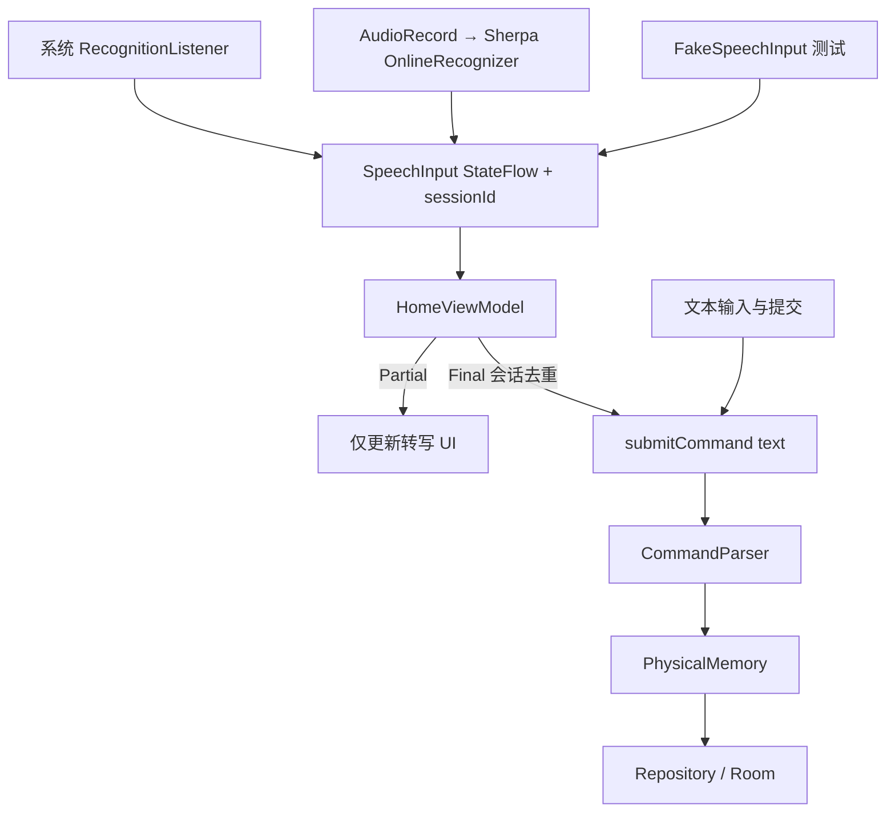

# Physical Memory V1 ASR Report

验证日期：2026-09-02。版本：0.2.0 / versionCode 4。源码目录继续使用 physical-memory-v0，包名 dev.local.physicalmemory，Room schema v1，不迁移或清空已有记录。

**实现、完整构建和模拟器验证已完成；Find X8s 真人语音验证待设备连接。对该手机两引擎优劣的结论为 Insufficient evidence。**

## 1. Goal

保留 V0 文本 STORE/FIND、最近记录和模糊名称匹配，新增 Android 系统 STT 与 Sherpa 本地 streaming STT，最终汇入同一个命令执行方法。不实现 TTS、云端 ASR 集成、热词、别名、LLM 或语义纠错。

实现前审查及修改范围见 [preimplementation audit](../../docs/physical_memory_v1_preimplementation_audit.md)。

## 2. Final Architecture



仅增加输入适配器与开发信息。Repository、Room 表、CommandParser 和模糊匹配规则均保留。语音错误不禁用文本输入；手动编辑/提交会取消正在识别的会话，避免迟到 Final 覆盖草稿。

## 3. SpeechInput Abstraction

接口提供 state / metrics / availability StateFlow，以及 startListening(sessionId)、stopListening、cancel、release。startListening 的 ID 由 ViewModel 分配 UUID；每次讲话独立 ID，重复说相同句子属于不同会话，允许正常执行。

实现为 AndroidSpeechInput、SherpaOnnxSpeechInput、FakeSpeechInput。SessionSpeechInput 在适配器层丢弃已取消或已终结会话的回调，ViewModel 再校验当前 ID 并在解析前认领 Final，避免重复或变化后的 Final 再次 STORE。

## 4. Android SpeechRecognizer

- 创建、设置 listener、开始/停止、cancel/destroy 均在主线程执行；使用 Application Context，不持有 Activity。
- 启动时探测 normal/on-device 服务；API 31+ 且报告可用才尝试 createOnDeviceSpeechRecognizer。创建失败时，如果普通服务存在则回退 createSpeechRecognizer。实际 mode 写入 metrics，不将普通服务标为离线。
- 识别请求使用 free form、zh-CN、partial=true、maxResults=1。
- onReady、onBeginning、onPartial、onEnd、onResults、onError 映射到统一状态。RMS 回调记录系统提供的电平峰值用于诊断，不冒充声学边界。
- 错误含 NO_MATCH、NO_SPEECH、NETWORK、NETWORK_TIMEOUT、BUSY、权限、SERVER、CLIENT、语言不可用等中文提示，并保留 raw code。
- 45 秒防御超时；终结、取消和 release 均 destroy。创建异常不让应用崩溃。

Manifest 添加 RECORD_AUDIO、可选 microphone feature 和 RecognitionService queries；没有添加 INTERNET。普通系统服务可能在其自身进程内联网，这取决于设备提供者；本项目没有自行调用云端 ASR。

官方依据：[SpeechRecognizer](https://developer.android.com/reference/android/speech/SpeechRecognizer)、[RecognitionListener](https://developer.android.com/reference/android/speech/RecognitionListener)、[RecognizerIntent](https://developer.android.com/reference/android/speech/RecognizerIntent)。

## 5. Find X8s Capability Probe

Find X8s 未连接，manufacturer/model/Android/SDK/ABI/RAM/default provider/on-device availability 全部待实测。不能依据型号猜测。

实际连接的测试设备是 emulator-5554，Android SDK built for arm64，Android 16 / API 36。App 内探测 normal=false、on-device=false、services=[]、defaultProvider=null。设备原始属性、RAM、包信息、PSS 与 App 内 probe 见 [emulator/device-probe.json](../../physical-memory-v1-validation/emulator/device-probe.json) 和 [events.jsonl](../../physical-memory-v1-validation/emulator/events.jsonl)。

scripts/collect-asr.py 强制 --serial，只读收集设备信息、logcat 和本地 ASR JSONL；不自动改网络、清库或授予手机权限。

## 6. sherpa-onnx

查询官方 release API，当前非预发布稳定版为 **v1.13.7，发布于 2026-09-01**。采用官方完整 Android AAR，Gradle 本地文件依赖，只打包 arm64-v8a；无自行拼接 JNI 源码或博客依赖。固定 SHA-256，setup-asr-assets.py 可重取并校验。

来源：[官方 release](https://github.com/k2-fsa/sherpa-onnx/releases/tag/v1.13.7)、[官方 AAR 构建说明](https://github.com/k2-fsa/sherpa-onnx/blob/v1.13.7/android/SherpaOnnxAar/README.md)、[官方 Kotlin API/config](https://github.com/k2-fsa/sherpa-onnx/blob/v1.13.7/sherpa-onnx/kotlin-api/OnlineRecognizer.kt)。

## 7. Selected Model

- 名称：sherpa-onnx-streaming-zipformer-small-ctc-zh-int8-2025-04-01。
- 架构：Streaming Zipformer-CTC；INT8；中文；byte-BPE 词表 1000。
- 配置：CPU，2 inference threads，16,000 Hz，greedy_search；不启用 hotword/context biasing 或同音替换。
- 运行时模型 26,342,340 bytes + tokens.txt 13,366 bytes = 25.13 MiB。打包模型的压缩体积约 19.48 MiB。
- 官方下载包 21,264,113 bytes；只取模型和词表进 main assets。bbpe.model 和 WAV 不进主 APK；0.wav 仅进测试 APK。
- 模型由官方小模型目录列出，当前 Kotlin 示例包含该模型配置。对比调查过 14M Zipformer 的 74 MB 压缩包与约 1.047 GB 的 Streaming Paraformer 包；本轮选择 CTC 小模型用于快速离线验证，不能据体积断言识别更好。
- 当前模型仅面向中文，SD、XM5 等英文/数字物品名需要专门实测，不做自动纠错。

来源：[官方模型文档](https://k2-fsa.github.io/sherpa/onnx/pretrained_models/online-ctc/zipformer-ctc-models.html)、[官方小模型列表](https://k2-fsa.github.io/sherpa/onnx/pretrained_models/small-online-models.html)、[模型仓库固定 revision](https://huggingface.co/csukuangfj/sherpa-onnx-streaming-zipformer-small-ctc-zh-int8-2025-04-01/tree/a5f60fe00dcfbaf68fcc1c6b5cf53061e144d6da)。

开发阶段采用 assets 内置，无首次安装下载或模型路径配置。APK 从 12,066,592 bytes（11.51 MiB）增至 63,979,312 bytes（61.02 MiB），增加约 49.51 MiB；其中 Sherpa ARM64 原生库未压缩共约 29.89 MiB。体积显著增加，后续分发可以再评估模型目录/按需资源，不在本轮扩张。

代码库 Apache-2.0 许可已保留；已检查的模型包、模型卡和 checkpoint 卡没有明确模型许可字段，不把代码许可自动当成模型发布许可。完整下载和运行时文件校验和见 third-party/。

## 8. Audio Pipeline

AudioRecord 使用 MIC、16 kHz、mono、PCM16；最小 buffer 合法性检查，缓冲至少 6400 bytes，每次读取 1600 samples（100 ms），转换为 float / 32768 后送入 OnlineStream。采集、特征/解码和模型加载均在 IO worker，UI 不阻塞。

每次会话独立 native recognizer + stream，结束即释放，不长期缓存模型。stop 请求停止采集并 flush 后 Final；cancel 标记失效、停止 recorder 以解除 read 阻塞、丢弃结果。finally 释放 recorder，use 释放 stream/recognizer；终结状态在资源关闭后发布。共享协程线程池不创建长期私有线程。

采用官方 Kotlin EndpointConfig 默认：初始静音 2.4 s、含语音后的尾部静音 1.4 s、最长片段 20 s，另有 30 s 防御上限。主动停止/文件末尾补充尾部上下文并 inputFinished；没有用自创的 300 ms 静音规则。参照 [官方 Android sample](https://github.com/k2-fsa/sherpa-onnx/blob/v1.13.7/android/SherpaOnnx/app/src/main/java/com/k2fsa/sherpa/onnx/MainActivity.kt)。

## 9. UI Changes

保留原输入框、提交、结果、候选按钮和最近记录。结果仍在输入框下方。新增 System/Sherpa selector、能力/模型状态、点击说话/结束、取消、实时转写、权限提示和可展开 debug。

首次点击可用引擎麦克风才请求权限，拒绝后继续允许文字；不会自动反复请求。重复拒绝后提供应用权限设置入口。选择不同引擎会取消旧会话；Compose 重组不创建新引擎。


## 10. State Machine

Idle → Initializing → Listening → Partial（多次）→ Finalizing（可选）→ Final / Error。取消回 Idle。

Partial 只显示在独立转写区，既不覆盖文字草稿，也不触碰仓库。Final 写入输入框并复用 submitCommand(text)；STORE 成功后按原规则清空文本，转写区保留最终句子。Error 不清空草稿。

Activity onStop 取消当前语音；配置重建保留 ViewModel 和草稿但不继续旧录音；ViewModel.onCleared release 两个引擎。当前语音会话不在进程死亡后恢复。

## 11. Latency Metrics

全部时间戳使用单调毫秒时钟，null 表示未观测，不填 0。开始时间是权限获准后请求识别的时刻，不包括人工点击权限弹窗的等待时间。

| Field | Definition |
|---|---|
| startRequestedAt | 引擎接收 startListening |
| recordingStartedAt | 系统：onReadyForSpeech 回调代理值；Sherpa：AudioRecord 已进入 recording |
| speechStartedAt | 系统：onBeginningOfSpeech；Sherpa：首词元时间估计 |
| firstPartialAt | 第一个非空 Partial 到达 |
| finalResultAt | 非空 Final 发布 |
| speechEndedAt | 系统：onEndOfSpeech；Sherpa：最后词元时间估计，未获得时间戳则 null |
| startupLatency | recordingStartedAt − startRequestedAt |
| firstPartialLatency | firstPartialAt − startRequestedAt |
| finalLatency | finalResultAt − startRequestedAt，包含用户讲话时长 |
| speechEndToFinalLatency | finalResultAt − speechEndedAt，必须连同 speechBoundarySource 解释 |
| modelLoadMs | Sherpa native model + stream 创建耗时 |
| modelLoadedPssKb | 模型加载后应用进程 PSS 快照，非模型内存增量 |

Sherpa 的 token_timestamp_estimate **不是实测声学结束时间**，不能和系统回调数字直接当成精确同口径排名。本轮没有手机麦克风数据，也没有真实 speech-end ground truth。

每会话还记录 engine/mode/sessionId、转写、错误和 raw error、cancel 时间、PCM sample 数量。Logcat tag 为 PhysicalMemoryASR，数据落在私有 files/asr/events.jsonl；不保存原始音频。语音业务执行另外写 command 事件，含实际 CommandParser 的 item/location 和执行结果，与 sessionId 对齐，避免 benchmark 重新实现另一套解析器。

## 12. Tests

102 项 JVM 测试全部通过：原 88 项 + 10 项 SpeechViewModel + 4 项 SpeechInput/metrics/errors。

新增覆盖 Partial 零数据库操作、Final 只执行一次、重复/变化 Final、不同会话相同句子、Error/权限拒绝后文本继续、engine switch、迟到回调、页面停止、手动草稿保护、快速点击、release、Unknown。

19 项定向设备测试全部通过：Room 13、模糊候选 UI 1、正式库只读模糊查询 UI 1、Fake 双引擎 UI 1、真实 native 官方 WAV 1（内部两次加载/释放）、System probe 1、权限拒绝与 Activity 重建 1。

权限测试先在专用模拟器撤销 RECORD_AUDIO 并清除权限选择标记，保证测试前置条件；不把这一流程应用于用户手机。正式库测试前后所有行、ID、时间戳一致。测试结束只卸载测试包，正式应用保持运行。未执行会清除应用数据的 connected 任务。

复测命令（仅专用模拟器，权限前置条件会改变；不对手机执行权限重置）：

```sh
adb -s emulator-5554 install -r app/build/outputs/apk/debug/app-debug.apk
adb -s emulator-5554 install -r app/build/outputs/apk/androidTest/debug/app-debug-androidTest.apk
adb -s emulator-5554 shell pm revoke dev.local.physicalmemory android.permission.RECORD_AUDIO
adb -s emulator-5554 shell pm clear-permission-flags dev.local.physicalmemory android.permission.RECORD_AUDIO user-set user-fixed
adb -s emulator-5554 shell am instrument -w -e class dev.local.physicalmemory.RoomRepositoryTest,dev.local.physicalmemory.FuzzyChoiceUiTest,dev.local.physicalmemory.FuzzyLookupRegressionTest,dev.local.physicalmemory.SpeechUiTest,dev.local.physicalmemory.SherpaNativeTest,dev.local.physicalmemory.SystemCapabilityTest,dev.local.physicalmemory.SpeechPermissionUiTest dev.local.physicalmemory.test/androidx.test.runner.AndroidJUnitRunner
```

其中 FuzzyLookupRegressionTest 要求已有“连花清瘟”记录，权限 fixture 以当前 AOSP PermissionController 为测试目标；不要把这些 fixture 当成任意用户设备上的无条件验收命令。

## 13. Build Results

以下命令完整执行成功：

```sh
source ./env.sh
./gradlew clean test lint assembleDebug build assembleDebugAndroidTest --console=plain
```

Lint 0 error、9 warnings：7 个已有工具链/依赖更新提示、ARM64-only 的 ChromeOS ABI 提示、1 个 KTX 风格建议。保持已验证的固定 Android 工具链。Debug APK SHA-256：f9e2112858ce9d0f4d95697b74084ad019f57bb21e634ebce8165a2334123bf7。

构建与测试证据见 [full-build.log](../../physical-memory-v1-validation/full-build.log)、[unit-tests.json](../../physical-memory-v1-validation/unit-tests.json)、[device tests](../../physical-memory-v1-validation/emulator-device-tests.log)、[APK size](../../physical-memory-v1-validation/apk-size.json)。

## 14. Device Results

- AOSP 模拟器：系统服务不可用提示正常；真实系统语音未运行。
- Fake adapter：通过页面按钮切换引擎，Partial 不写库，Final STORE/FIND，同一业务入口。
- Sherpa native：官方 5,611 ms WAV 两次得到 8 次不同 Partial、非空 Final 和 native endpoint；加载 2671/2858 ms，文件解码 658/747 ms。加载期间测试进程 PSS 220,914/224,778 KiB。不是手机麦克风 benchmark，也不是本项目短句准确率。
- 权限拒绝后仍可文本查询；Activity 重建保留草稿；数据库无改变。
- Find X8s：未连接。麦克风捕获、真人 Partial/Final、离线表现、资源占用和 8 句实体结果均未测。

## 15. Android System vs Sherpa

完整表格见 [asr_engine_comparison.md](asr_engine_comparison.md)。本轮不能回答 Find X8s 上哪个更快或更准。

已有采集工具和测试句，手机接入后可继续：按测试句真人说话 → 记录 sessionId 与原话 → collect-asr.py → asr-benchmark.py。CSV 单独给出 itemExact/locationExact/commandExact；例如 XM5 与 XM五会保留实体不一致，不通过热词或 alias 修饰结果。

## 16. Known Problems

- 缺少 Find X8s 实机及真人语音，相关验收项仍未完成。
- 纯中文小模型对英文缩写和数字实体的表现未知。
- 1.4 秒 endpoint 尾部静音可能影响体感响应，需真机测量后再调，当前不凭直觉改阈值。
- Sherpa 词元结束估计与系统回调不是精确相同口径；需要真实音频标注才能严格比较声学结束到 Final。
- 每次会话重新加载模型，资源生命周期简单但增加启动成本；是否缓存应结合实机 startup/PSS 数据决定。
- 模型明显增加 APK 体积；模型许可未明确，不把本地评估当成发布许可结论。
- 只支持 ARM64；系统服务可能不发 Partial 或缺少中文模型，属于实际 provider 能力，需要实机记录。

## 17. Recommendation

**Insufficient evidence。** 保留双引擎和显式选择，暂不基于模拟器或源码预判 Find X8s 的默认引擎。先完成正常网络/断网、指定 8 句、实体正确性、延迟及 PSS 的实际观测，再给推荐。

当前可交付内容：可安装 APK、两个真实引擎实现、Fake 测试、完整构建与模拟器证据、采集脚本和 benchmark 模板。下一步仅缺已授权的 Find X8s 连接及用户真人说话样本。


## 验收状态

| 范围 | 当前状态 |
|---|---|
| 文本/模糊匹配、统一接口、双引擎代码、Fake、selector、权限提示 | 已实现，相关自动测试通过 |
| Partial 零业务操作、Final 去重、STORE/FIND 共用路径 | Fake + Unit + 隔离 Room/Compose 通过 |
| Sherpa model load / streaming partial / endpoint / final | 真实 ARM64 native 官方 WAV 通过 |
| System capability probe | 模拟器实测不可用；Find X8s 待连接 |
| 麦克风真人 STORE/FIND、系统真实识别回调 | Find X8s 待测 |
| ASR latency collection | 结构、调试区、JSONL/CSV 工具已实现；native 文件加载/解码已测；真人会话数为 0 |
| Unit / lint / assembleDebug / build | 全部通过；lint 无 error |
| Find X8s 安装、权限、离线、内存、8 句实体对比 | 待实机与用户语音 |
| 双引擎对比报告 | 已生成，实机结论 Insufficient evidence |

模拟器耗时有明显波动：较早一次实测加载 425/354 ms、解码 96/95 ms，最终复测为上表/正文数字。见 [timing history](../../physical-memory-v1-validation/native-timing-history.json)。未控制宿主负载和调度，不能将这些数字当成手机性能或稳定性结论。
