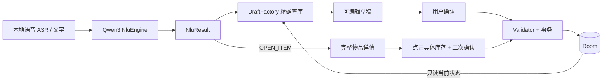

# Physical Memory V2 架构

**同一种 Item 的全部库存实例始终共享唯一的 Item.location。模型只提出候选，用户确认后才保存。**

## 模块边界

| 模块 | 职责 |
|---|---|
| `voice/` | 保留 Qwen3-ASR 0.6B INT8、录音会话隔离、取消与缓存模型 |
| `nlu/` | 4 种 NluResult、Schema 解码、Prompt、NluEngine、JNI 适配；不引用 Repository/DAO/实体 |
| `domain/draft/` | 将候选和现有数据库快照合成 Create / Update / Add 草稿、可编辑实例及校验 |
| `data/database/` | Room v2、显式迁移、Item 和 InventoryUnit、确认回执 |
| `data/repository/RoomInventoryRepository` | 精确查找、校验快照、原子确认、只删除所选一行 |
| `ui/inventory/` | 原文重解析、直接改字段、详情、确认和删除弹窗、性能信息 |

实际入口为 `MainActivity → InventoryViewModel`。旧 HomeViewModel / PhysicalMemory / CommandParser / FuzzyItemMatcher 保留用于历史回归，已退出 V2 入口。系统语音引擎的旧代码仍在，但 V2 只提供本地 Qwen ASR，以免系统供应商走云端识别。应用无 INTERNET 权限。

## 本地模型与结构化输出

`NluEngine` 提供 `parse(text,currentDate)`、`warmUp()`、`cancel()`、`release()` 与 metrics StateFlow；业务层不知道 JNI。Qwen3NluEngine 串行管理缓存 runtime；LlamaNluRuntime 是唯一 JNI 适配器。FakeNluEngine 必须显式注入，供 JVM、Compose、模拟器验证使用；生产缺少模型会报错，不会悄悄改用 Fake 或规则解析器。

模型只输出 UPSERT_ITEM_INFO、PROPOSE_ADD_UNITS、OPEN_ITEM、UNKNOWN，不接触数据库内容或 ID。JSON Schema 使用 Draft 2020-12、oneOf、action 常量及 additionalProperties=false；由它生成的 GBNF 在采样前约束 token。Kotlin 再严格检查字段、类型、枚举、重复 issues、SET/KEEP 一致性。真实日历日期和库存数量由确定性 Validator 检查。语法合法不代表事实正确，因此始终展示可编辑候选。

System Prompt 保持简短，配少量格式示例。每次加入 currentDate，示例与当前输入不继承业务事实。用户输入中的特殊聊天分隔符会转义。非 thinking 使用 Qwen 的空 think 前缀；thinking 对照在 `</think>` 后启用同一 JSON 语法，缺少终止、超时或不完整结果均拒绝。

## 数据与迁移

Room 1→2 增加 lowStockThreshold（默认 0）、inventory_units、confirmed_drafts，保留旧 Item 的所有已有字段。旧版没有库存事实，所以迁移后为 0 个实例，不凭空补数量。正式应用不卸载、不清空。

Item.location 空字符串仅代表新物品尚未记录位置。KEEP 保留原值；已有非空位置不能在确认时清空。InventoryUnit 仅有 id、itemId、expiryDate、createdAt、updatedAt，没有任何位置字段。数量始终取 child rows 的数量。删除最后一个实例不会删 Item。

unit_label 是新增草稿中的可编辑用词，P0 实例按“份”展示，不额外引入包装换算或独立数量事实。过期日期 null 表示未记录；已经过去的合法日期可以如实保存。

## 草稿与事务

DraftFactory 只读数据库。UPSERT 不存在则 Create，存在则 Update，展示当前位置、提议位置及现有库存数；ADD 生成 N 个独立 DraftUnit，默认日期复制到每份，可逐份修改或清空。复杂多份日期不自动分配；若模型 issues 含 AMBIGUOUS_DATE，各份默认日期留空，即使模型同时返回了 default_expiry，仍由用户逐份填写。

原始识别文字可编辑重解析；文字改变使旧草稿失效。直接改结构化字段不运行 NLU。改物品名会重新精确查询，查询完成前不能确认。继承的位置随新选择的 Item 更新；用户或模型明确提出的位置作为提议保留，并显示 old → new 及对全部旧、新库存的影响。

确认时同一 Room 事务执行：校验字段 → 优先检查相同草稿回执 → 比较目前 Item 和全部 Unit 与已展示快照 → 更新位置/插入实例 → 写回执。过期草稿拒绝覆盖，草稿 ID 加载荷指纹避免重复添加。位置相同跳过 Item UPDATE，时间戳不变；位置不同时只改 Item，不改旧 Unit。实例新增和位置修改原子提交。

OPEN_ITEM 无论来自位置、数量、到期或删除语言，都进入相同详情。每个实例都有删除按钮，UI 选定真实 unitId 后二次确认，Repository 再检查该实例并删除一行。模型不选择删除对象，也没有整件或批量删除接口。

## 生命周期与观测

推理在后台线程串行执行，CPU 推理支持取消、时间及 token 上限；取消或后台请求不能发布迟到草稿。后台保留模型，销毁 ViewModel 时等原生工作退出后释放。仅缓存完全相同的提示前缀，每次移除上一轮回答及不同的用户输入后缀，记录 cachedPromptTokens。

记录 modelLoadMs、promptTokens、prefillMs、TTFT、decodeMs、generatedTokens、totalNluMs。PipelineTiming 用同一单调时钟记录 speechEnd/asrFinal/nluStart/nluFinal/draftReady。真实录音沿用手动停止，因此 speechEnd 标为 manual_stop，不声称测到了声学结束；录音回放另标 saved_wav_replay_stop。未观测值为空。

## 依据与版本

- [官方 Qwen3-1.7B GGUF](https://huggingface.co/Qwen/Qwen3-1.7B-GGUF)，固定 revision `90862c4b9d2787eaed51d12237eafdfe7c5f6077`，Apache-2.0。
- [llama.cpp Android 文档](https://github.com/ggml-org/llama.cpp/blob/c1d0e7a004015f23bc0233470b747b596f29b264/docs/android.md)，MIT，完整来源记录在 third-party/llama-version.json。
- [GBNF 与 Schema 约束说明](https://github.com/ggml-org/llama.cpp/blob/c1d0e7a004015f23bc0233470b747b596f29b264/grammars/README.md)。实际 JNI 按固定源码 API 实现。

选用 llama.cpp 是因为官方 GGUF、Android CPU 与 token 语法约束可在同一运行库完成；没有足够理由引入额外转换链、GPU/NPU 优化或其他框架。
