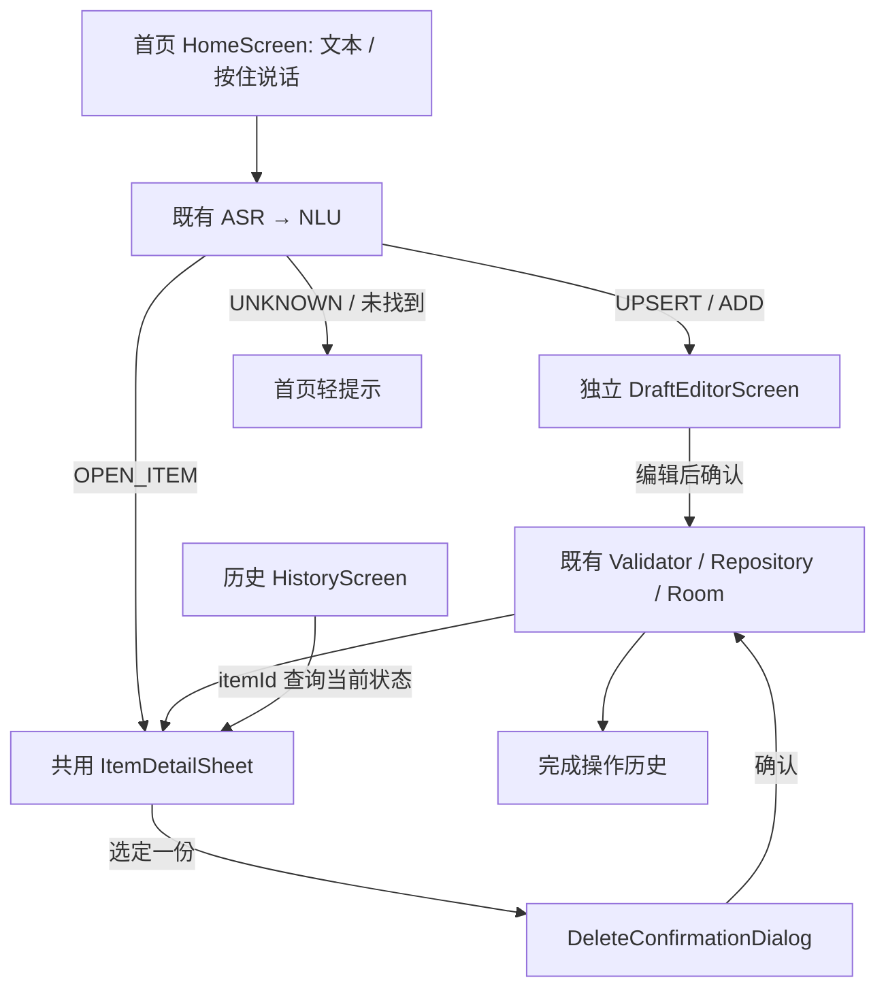

# UI/UX 重构架构与实施计划

在现有 physical-memory-v0 原目录修改，不创建项目或 Demo。当前目录没有 .git 元数据；保留源码基线与关键文件 SHA 便于比较。

## 审查结论

MainActivity 当前仅有 InventoryScreen 单页，草稿、详情、语音、调试、最近物品均位于同一个 LazyColumn。InventoryViewModel 已具备可靠的解析、草稿确认与单份删除操作；继续复用。当前 recent() 是物品列表，不能作为完成操作的历史。Qwen ASR 在解码前检查取消，但调试 WAV 保存发生在检查之前，需要移动取消检查，才能真正丢弃取消音频。

## 实施顺序

1. 保留核心文件校验值并备份实机数据库。
2. 加入 Navigation Compose，只有首页 / 历史两个一级入口，草稿为独立路由，详情为复用 ModalBottomSheet，删除为独立确认弹窗。
3. 新增独立 HoldToTalkController / HoldToTalkButton，状态含准备、Idle、Recording、CancelArmed、Processing；基于手指相对初始位置上滑 96 dp 判断，滑回恢复。最短真实录音 400 ms，取消在解码前完成。
4. 单独的轻量 HistoryDatabase 保存已完成操作的摘要、时间、itemId；不改变 Item/InventoryUnit 表，不回填虚构历史，不保存库存快照。只在成功查询、确认草稿或确认单份删除后追加，取消不追加。
5. 扩展 ViewModel 的页面接口，复用原 NLU / DraftFactory / Repository；history 与 hold 各自独立 StateFlow，各页面只接收其所需状态。
6. 新增手势、取消边界、导航、历史当前状态、Sheet 内原地删除测试；执行全构建和小米定向 instrumentation，保存七类截图。正式应用仅覆盖安装，不卸载或清空。

## 核心不变

ASR / NLU 模型、NLU Prompt、Schema、DraftFactory、Item/InventoryUnit 定义与主数据库 v2、核心 Repository 操作保持不变。语音新增的准备/最短长度/必须显式停止接口仅用于适配手势，不改变模型推理和识别结果。默认参数保持旧测试入口兼容。

## 官方 API 依据

- [Navigation Compose](https://developer.android.com/develop/ui/compose/navigation)
- [Pointer gesture 生命周期](https://developer.android.com/develop/ui/compose/touch-input/pointer-input/understand-gestures)
- [可展开 Bottom Sheet](https://developer.android.com/develop/ui/compose/components/bottom-sheets-partial)

## 实际页面与状态

Navigation Compose 2.9.7 是唯一导航实现。NavHost 包含 home / history / draft；一级 NavigationBar 只有首页与历史。草稿路由打开时隐藏底部 Tab，返回或取消丢弃草稿，重解析时仍留在编辑页。确认成功退出编辑，显示结果信息卡片。

- `HomeScreenState`：只含文字、处理状态和轻提示，不含物品列表、草稿或历史。
- `DraftEditorUiState`：原始/修正文本、可编辑草稿、名称查询与确认状态。
- `ItemDetailUiState`：当前 Item、选中的单份删除确认、提交状态；Sheet 内部列表可滚动。
- `HistoryUiState`：操作行与历史存储错误，通过独立 StateFlow 提供。
- `HoldToTalkState`：独立 controller StateFlow，只负责手势、准备和录音时长。
- `SpeechUiState`：原 ASR 状态/指标和权限反馈；不再复用旧版巨大的 HomeUiState。
- `InventoryViewModel`：继续作为现有业务协调入口；不把路由实现塞进 NLU / Repository。

`ItemDetailSheet` 是文本查询、语音查询、历史点击、确认成功后的共同组件。使用 Material 3 ModalBottomSheet，支持半展开、上拉展开、内部 LazyColumn 滚动，以及下滑/遮罩/返回/关闭按钮关闭。关闭 UI 不写数据库；提交删除时暂时禁止关闭以避免状态不一致。删除确认弹窗是独立 AlertDialog，仅承载二次确认。

## 历史存储

新增独立 `operation-history.db`，Room v1，仅一个 history 表：operationKey / itemId / itemName / summary / completedAt。原 physical-memory.db 保持 v2，Item、InventoryUnit、confirmed_drafts 表与操作语义不变。

记录成功查询、已确认草稿、已确认单份删除；不记录开始录音、取消、过短、解析候选、未找到、UNKNOWN 或仅打开旧历史。draft/unit 使用稳定操作 key 去重，查询使用每次请求的新 key。过去没有可靠操作日志，升级时历史为空，不把已有物品列表冒充操作历史。

历史点击只用 itemId 重新查主 Repository；summary 是历史描述，不参与重建状态，未保存库存实例快照。库存和历史是两个独立存储，日志追加失败不回滚已经完成的真实操作，并在历史页显示提示；进程在两次写入之间被杀可能遗漏一条历史。这是 P0 简单完成日志的已知边界，不引入跨数据库事务或 Event Sourcing。

## 最小接口调整

唯一语音引擎适配是 warmUp、400 ms 采样长度门槛、必须显式停止参数和取消检查提前；ASR 模型、decoder 与 NLU 均不变。Activity 在 onPause 取消录音（早于旧版 onStop）；核心确认、快照校验、库存数量和单份删除完全复用。19 个受保护核心文件的 SHA 对比记录在验证目录。
